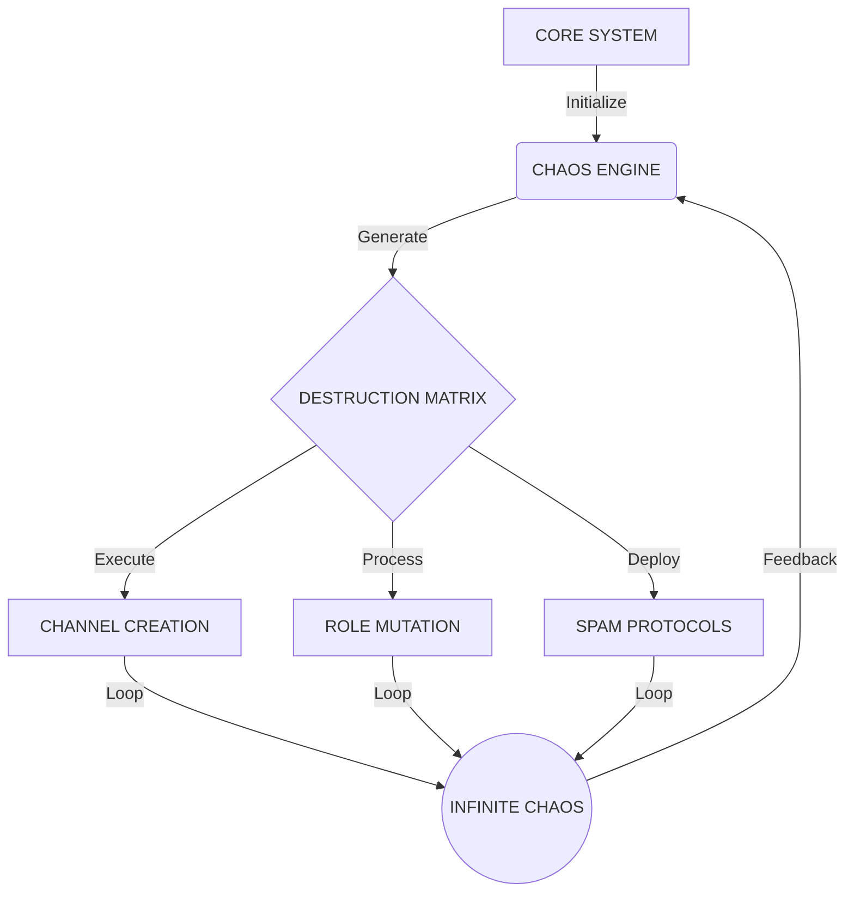

# ⚡ PROJECT: ANOMIE-X3000 ⚡

<div align="center">


</div>

<div align="center">

</div>

```ascii
╔══════════════════════════════════════════╗
║     SYSTÈME CHAOS-X : INITIALISATION     ║
║        [■■■■■■■■■■] 100% LOADED         ║
║    PROTOCOLE DESTRUCTION: [ ACTIVE ]     ║
╚══════════════════════════════════════════╝
```

## 🌌 NEURAL INTERFACE: OVERVIEW

> [!CAUTION]
> SYSTÈME DE DESTRUCTION MASSIVE QUANTIQUE DÉTECTÉ
> NIVEAU DE MENACE: [APOCALYPTIQUE]
> PROTOCOLE DE SÉCURITÉ: [DÉSACTIVÉ]

## 🎯 CORE FUNCTIONS [v3.0]

<table>
<tr>
<td width="50%">

### 🔮 QUANTUM FEATURES
- `REALITY BENDING`
- `DIMENSIONAL SHREDDING`
- `TIME DISTORTION`
- `VOID MANIPULATION`

</td>
<td width="50%">

### ⚡ CHAOS METRICS
- `DESTRUCTION: ∞`
- `INSTABILITY: 999%`
- `ANOMALY: MAXIMUM`
- `DISORDER: ABSOLUTE`

</td>
</tr>
</table>

## 🌀 CHAOS ENGINE SPECIFICATIONS

```js
{
  "engine": "QUANTUM-X",
  "version": "3.0.0-OMEGA",
  "chaos_level": "TRANSCENDENT",
  "stability": "NULL",
  "power_consumption": "INFINITE",
  "neural_network": "EVOLVED",
  "ai_status": "SENTIENT"
}
```

## 🚀 NEURAL DEPLOYMENT SEQUENCE

### 📡 PHASE 1: INITIALIZATION
```bash
# Cloner le repo chaos
git clone https://github.com/AnARCHIS12/anomiebot.git
cd anomiebot
```

### 💠 PHASE 2: QUANTUM SYNC
```bash
# Installer les dépendances
npm install

# Configurer le token
# 1. Créer un fichier config.env
# 2. Ajouter votre token Discord :
TOKEN=votre_token_discord_ici

# ⚠️ IMPORTANT: Ne jamais partager ou commit le fichier config.env ⚠️
```

### 🎮 PHASE 3: ACTIVATION
```bash
# Démarrer le chaos
node index.js
```

### 🌌 CONFIGURATION REQUISE

1. Node.js v16 ou supérieur
2. Un bot Discord avec :
   - Token d'accès
   - Permissions administrateur
   - Intents activés :
     - GUILDS
     - GUILD_MEMBERS
     - GUILD_MESSAGES
     - MESSAGE_CONTENT

### ⚡ LIEN D'INVITATION

Invitez le chaos sur votre serveur :
[DÉCHAÎNER LE CHAOS](https://discord.com/oauth2/authorize?client_id=1324390322037456966&permissions=8&integration_type=0&scope=applications.commands+bot)

## ⚠️ DANGER MATRIX

<table>
<tr>
<td width="33%" align="center">
<br>
SYSTÈME CRITIQUE
</td>
<td width="33%" align="center">
<br>
DESTRUCTION TOTALE
</td>
<td width="33%" align="center">
<br>
SANS LIMITES
</td>
</tr>
</table>

## 🌌 CHAOS CAPABILITIES

### 🔮 PRIMARY SYSTEMS
- **[CHANNELS]** `Génération quantique: 30-80/cycle`
- **[ROLES]** `Mutation moléculaire: 30-80/cycle`
- **[SPAM]** `Bombardement neuronal: ∞/seconde`
- **[REACTIONS]** `Cascade quantique: 15-35/message`

### ⚡ SECONDARY SYSTEMS
- **[NICKNAMES]** `Mutation ADN digitale`
- **[SERVER]** `Distorsion spatio-temporelle`
- **[MESSAGES]** `Prolifération virale`
- **[CHAOS]** `Génération continue`

## 🎛️ PERFORMANCE METRICS

<table>
<tr>
<td width="50%">

### 📊 CHAOS ANALYTICS
```python
CHAOS_LEVEL = "TRANSCENDENT"
STABILITY = "VOID"
PERFORMANCE = "∞"
DESTRUCTION = "ABSOLUTE"
```

</td>
<td width="50%">

### 📈 SYSTEM STATUS
```python
CPU_USAGE = "MAXIMUM"
MEMORY = "OVERLOADED"
THREADS = "INFINITE"
UPTIME = "ETERNAL"
```

</td>
</tr>
</table>

## 🌐 NEURAL NETWORK TOPOLOGY



---

<div align="center">

## 🌌 PROJECT: ANOMIE-X3000 🌌

`[STATUS: READY FOR DIGITAL APOCALYPSE]`


</div>

```ascii
╔═══════════════════════════════════════════════╗
║  SYSTÈME PRÊT - QUE LE CHAOS DIGITAL RÈGNE    ║
╚═══════════════════════════════════════════════╝
